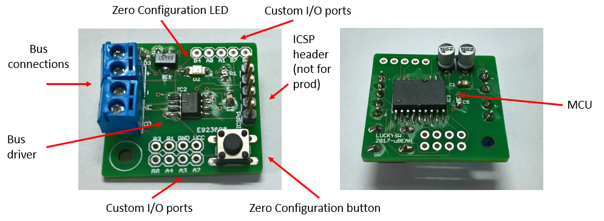

# Home

This is a hobbist/educational fulls stack project about Internet of Things (IoT) for DIY enthusiasts. It starts from scratch, using bare microcontrollers (MCU), network, and PC software without any relevant dependency.

The idea is about implementing a lost-cost open-source, open-hardware wired platform for general purpose automation control (for example domotic projects, security, garden automation, etc...). It is designed to connect a whole home and its surroundings.

The core of the project is a tiny MCU board that can embedded in any hardware, even a normal wall switch.

Node-to-node communication happens via common 4-wire or 6-wire low-voltage cables, like KNX, CAN-bus or other commercial systems, using industrial-grade [RS-485](https://en.wikipedia.org/wiki/RS-485) specifications for great scalability. Node-to-master communication is through IP (e.g. ethernet, wifi, etc...) for improved scalability. This allow wireless nodes to be implemented as well. 

What this project is aimed to:
- connect any type of sensor 
- integrate devices that can be interfaced via a MCU
- log data
- implement custom logic to automate tasks
- have a web interface for remote control

The bus structure allow extension with other open standards for IoT.

# The network

The network topology uses two mediums: a custom wired low-voltage bus to allow simple MCUs to be used, and a higher LAN/IP level to aggregate wired sections and server connection.

The wired design is similar to the [KNX](https://en.wikipedia.org/wiki/KNX_(standard)) open standard. However, instead of using proprietary electrical bus drivers, it relies on the broadly available [RS-485](https://en.wikipedia.org/wiki/RS-485) standard (for example, a [Maxim MAX485 IC](https://www.maximintegrated.com/en/products/interface/transceivers/MAX485.html) can be used as a driver).

An industrial-level RS-485 bus can range up to 32 nodes on the same wire and span hundreds of meters, even on electrically noisy environments. See [Maxim Integrated AN](https://www.maximintegrated.com/en/app-notes/index.mvp/id/3884).

Frames are byte-oriented, allowing a common bi-directional [UART](https://en.wikipedia.org/wiki/Universal_asynchronous_receiver-transmitter) to be used. This simplifies the selection of the hardware, since no bit-level CAN-bus or MODBUS logic is required. 

Each wired section needs to contain a *master* node, that allows IP connection to the server through Wi-Fi or Ethernet cables (it needs both UDP and TCP).

The custom protocol built on top is designed to offer features to ease the network installation:
- Auto-discovery for all connected nodes
- Zero-configuration: allow dynamic allocation of nodes via push-button and a PC application
- Fail-over due to bus failures, IP connection failures or node failures.

The byte-level message-based protocol is then shared between wired sections and to increase simplicity and issue analysis.

More details [in this page](doc/protocol.md).

# The microbean (µBean)

The prototyped hardware is a small board (just 30x28mm) built around a cost-effective [Microchip PIC16F1827 MCU](https://www.microchip.com/wwwproducts/en/PIC16F1827), a RS-485 level adapter and a voltage regulator. The board expose almost all MCU lines to the maker, allowing a great amount of free digital and analog I/O pins.

Once the MCU are programmed, the network topology can be easily configured with a PC.

Each physical node exposes one or more applicative drivers, called *sinks*. In this way, a single bean can be programmed to interface more than one device.

More details can be found [here](./src/nodes/doc/microbean.md).

# Some examples

## Light control

One bean installed in each wall box.
- Common switches will be used as low power digital switch drivers, or push button style
- Touch switches support
- RGB LEDs can be installed in each switch allowing soft tone transitions and night mode
- Power line relays or FET boards in separated junction boxes to control lights
- PWM with zero-cross detection dimmer boards for bulbs that support it
- IR motion/presence sensors support
- Luminance sensors for power saving support

## Intrusion detection and report

- A bean for each IR/motion sensor.
- A bean in junction boxes for window and doors magnetic switch.
- Beans at entrances for RFID or physical keys.
- Real-time notification of unusual activity
- Phone call/SMS/IM alert
- Remote control
- Remote activation/deactivation
- Smartphone control

## Climatization

Beans can be used to interact with existing climatization systems
- Temperature and humidity sensors
- IR emitters for fans and air conditioning units
- Actuator interfacing for motorized window shutters
- Regulation made based on weather forecast services

## Garden irrigation system

- Beans to control electrical valves
- Rain sensors
- Level meter for water tanks
- Relays board for submerged pumps
- Planning made based on weather forecast services

## Power management

- Interfacing with power meters that supports a serial port or a IP protocol.
- Interfacing with solar inverters.
- Wind meters to auto-close awnings.
- Connection with smart meters and devices.

# How to build

The project contains software elements (the .NET server, the node simulators and the control panel UI), hardware (the microbean) and the firmware for these nodes.

It is however possible to run the system with a software-only environment, using the node simulators to have a try.

## The server

The server code is a C# command-line process. It doesn't have any 3rd party dependency other than the .NET Framework, and it could be easily ported to [.NET Core](https://dotnet.microsoft.com/download).

However, currently it requires [Visual Studio](https://visualstudio.microsoft.com/) and [.NET Framework 4.x](https://dotnet.microsoft.com/download).

The project is splitted between the core part and the samples dlls, that are loaded automatically at startup via a plug-in load system, allowing modular architecture.

In addition, a WPF application is generated as a administrative interface (to visualize and set-up the network hierarchy) and to allow simulation of node logic and his sinks.

See [here](src/server/README.md) for more information.

## The master node

A master node is required to translate the IP connection from the server to the wired sections.

Custom hardware can be used there, but the simplest solution is perhaps to use an Arduino or a [Raspberry Pi Zero W](https://www.raspberrypi.org/products/raspberry-pi-zero-w/): something that can drive a bidirectional serial port and that can be connected to the LAN.

In this project you will found two implementations:
- for Raspberry (Raspbian) 
- for Microchip MCU with Ethernet support (e.g. PIC18F87). The [Microchip MPLAB X IDE](https://www.microchip.com/mplab/mplab-x-ide) with [XC8 compiler](https://www.microchip.com/mplab/compilers) is required in this case.

See [here](src/nodes/README.md) for more information.

## The wired node

You will find the schematics and the Microchip firmware to implement a wired node. Different ranges of MCU can be used, since the code and data requirements are quite limited.

The [Microchip MPLAB X IDE](https://www.microchip.com/mplab/mplab-x-ide) with [XC8 compiler](https://www.microchip.com/mplab/compilers) is required to compile the firmware and the samples.

See [here](src/nodes/README.md) for more information.

## The web server

A minimalistic web-server implementation is presented to allow remote access to the applications exposed by the server.

See [here](src/web/README.md) for more information.
