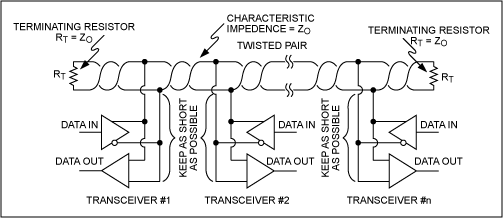
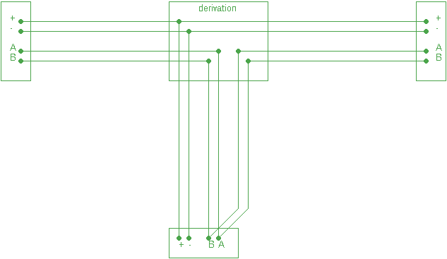

# Detailed network documentation

Frames on the network (both wired and IP trunks) are byte-oriented.

This allows a common bi-directional [UART](https://en.wikipedia.org/wiki/Universal_asynchronous_receiver-transmitter) to be used on the wired nodes. This simplifies the selection of the hardware, since no bit-level CAN-bus or MODBUS logic is required. Basically all 8-bit MCUs todays are equipped with basic UART hardware flow control, leaving computational power to the application.  

# Wired bus

## Physical layer

Each wired trunk uses:
- two-wires for the RS-485 industrial standard (differential line). They are usually called A and B.
- two-wires for the power supply (for example 12/15V, unregulated). The negative supply *must* be the ground for the RS-485 data lines, otherwise another wire should be used.

The RS-485 bus is half-duplex bidirectional, in a multi-master scenario. So every node can receive and transmit over the bus.

Similarly to the most common commercial solutions for electronic switches (BTicino, Samsung, Knx), a 4-wire cable can be used to transport power and data. However different type of cables can be used (twisted pairs, UTP, shielded, etc...): there are no special requirements for shielded cables, if they pairs are twisted.

The simplest "bus line" topology requires 4-wires cables, with 120ohm terminators on each end to absorbe reflections. The two data wires are represented in this figure:

 
*From [Maxim RS-485 Tutorial](https://www.maximintegrated.com/en/app-notes/index.mvp/id/763)*

However, in real-case wall installations, it is common to find the need to make long derivations from the main trunk.
This case can be correctly implemented using a 6-wires cable. This is the same type of hardware used by digital wired alarm systems, with a black/red pair usually thicker than the four other wires dedicated to data.

*Example of correct RS-485 branching junction using 6-wires cable, 3 nodes shown.*

RS-485 supports quite long wiring range at medium bitrate. The bitrate used by the Home project is 19200 baud, since it is not planned to support multimedia streams.

RS-485 level adapters are widely available in small packages. Same is for small package regulators (like 3.3V and 5V), so the final board can be extremely reduced in size. See [microbean](../src/nodes/doc/microbean.md) prototype implementation. 

## Logical layer

Multi-master logic using 9 bits packets makes possible to address multiple nodes on the bus, and to implement bidirectional channels without the need to cope with collisions (round-robin scheduling logic).

Correct timing for master arbitration requires real-time logic for switching from transmission mode to receiving mode.

All Microchip MCUs offer [UART](https://en.wikipedia.org/wiki/Universal_asynchronous_receiver-transmitter) implementation with 9bit support, and real-time high-resolution timers.

> Other bus implementation like CAN-bus makes use of break signal, that can be used as interrupt signal from the slave nodes when they are not addressed. To minimize collision chance, breaks should be sent in time slot fashion.

Addressing is initialized with a zero-configuration solution. A push button and a led can be used to manually trigger pairing. One node at a time is then located on the network and assigned to the master. Non volatile memory is required to make the assignment permanent until next explicit reset.

## In details

The master node always initiate the communication. The slave stations (nodes) can only transmit when addressed by the master node. 

The frame timings are following the standard [UART](https://en.wikipedia.org/wiki/Universal_asynchronous_receiver-transmitter), and in particular:
- 9 data bit (8 for data, 1 for channel addressing),
- 1 start bit,
- 1 stop bit.

for a total of 11 bits per frame.

When the master node switches the control to another node, it could be possible to generate a spike on the bus, due to engaging and disengaging of the line from the RS-485 driver.

For this reason, we need to leave a blank space in this gap that other receiver can discard as frame errors.

|  Node  | Time slot t0 | t1  | t2 | t3 | t4 | t5 | t6 |
|:------:|:-----:|:---:|:----:|:-----:|:----:|:---:|:------:|
| **master** |  TX frame *fN-1*   | TX frame *fN* |  TX *unasserted*  |  TX *unasserted*  |      |     | 	    | 
|  **node A** |       |     |      |  TX *unasserted*  |  TX *unasserted* |  TX frame *f0* |  TX frame *f1*   | 

After the last byte sent on the bus, the first talking station (*master* in the above diagram) must maintain the RS-485 engaged for another two bytes, and then release the channel.

The second station that was addressed to talk (*node A* in this case) should engage the line after a wait byte, then wait for two bytes time before start transmit data.

There is an approximate frame length in the middle (t3) that sees two nodes driving the channel at the same time, but without transmitting any data (line unasserted).

The *t2+t3* time and *t3+t4* time doesn't need to be 100% accurate with the UART baud rate. The first start bit (at t5 in the above diagram) will act a new sync start.

## Zero-configuration

In order to be addressed and enabled on the bus, each node should have an address (e.g. 5-bit to allow up to 32 slave nodes on the same bus trunk).

Instead of being pre-programmed, address can be dynamically assigned when the system is installed. 

Each slave node has to be equipped with a LED and a push-button.

When powered up for the first time, the node doesn't have a valid address, so it will never engage the bus for communication. The LED in that case flashes, and the new node cannot be detected by the master.

The installer pushes the button to initialize the configuration. At this point, the node will respond at the first address assignment request slot sent by the master node, and until that the LED will stay lit fixed.

When the master node successfully assign an address to the requesting node, the LED will switch off, and the address will be stored in the non-volatile memory of the node.

Only one node at a time can be in the address assignment state on the same bus line. For this reason the push button is required: the installer will push one button at a time until the node is configured.

Each configured node - hence with a valid address - can be engaged at any time by the master node for communication.

> A subnode cannot be moved across different bus trunks without resetting its bus address first. This has to be done pressing the push button with the data line disconnected.

## Master commands

A valid packet frame contains a preamble to skip any frame errors due to collision, electric arbitration switch or a node reset due to watch dog or issues.

Each packet is 4 frame long.

| Master packet structure | f0 | f1 | f2 | f3 |
| --- | --- | --- | --- | --- |
| | 1 55h | 1 AAh | 1 [aa] | 1 [msg] |

The 9-bit of each frame is always set to 1 when a packet is sent by the master to a node.

The third byte [aa] is the destination address of the message. Anything from 0 and 254 means a physical node. 255 is the broadcast address and it is used for new node address registration.

The fourth byte [msg] is the message identifier, and it can be:

- **0x01** Heartbeat. Sent periodically by master to check if a slave is responsive and alive. Addressed slaves should always respond with message **0x20** (hearbeat response). 
 If a subnode doesn't answer in less than a ACK_TIMEOUT period, the bus is considered free again.

- **0x02** Say Hello. Sent periodically by server to the broadcast address 0xFF.
  If a slave node need to be registered, it should respond with 0x21 (hello).
  If a subnode doesn't answer in less than a ACK_TIMEOUT period, the bus is considered free again.

- **0x03**: Assign address. This message is immediately sent after the receiving of the Hello response from a blank node without a valid address. This node has to store the address sent with this packet and not answering the Say Hello message anymore. 

- **0x04**: Socket open. Sent by master when a direct connection will start.
 Then bidirectional communication will start, with 9th bit reset. No ack needed. To break the connection both parties can send a discardable byte with 9th bit set. 
 After however the SOCKET_TIMEOUT period of no communication, the master node can break the socket and take the bus again.

In any of the above cases, the selected subnode should always respond immediately with another packet.

## Node responses

A valid response frame contains a preamble to skip any frame errors due to collision, electric arbitration switch or a node reset due to watch dog or issues.

Each response packet is 4 frame long.

| Response packet structure | f0 | f1 | f2 | f3 |
| --- | --- | --- | --- | --- |
| | 0 55h | 0 AAh | 0 [aa] | 0 [msg] |

The 9-bit of each frame is always reset to 0 when a response packet is sent by the node to the master.

The third byte [aa] is always the address of the transmitting node. 

The fourth byte [msg] is the message identifier, and it can be:
- **0x20**: Hearbeat response. Response by slave to heartbeat.
- **0x21**: Hello. Response by registering slave to Say Hello request. The node now waits for the next Assign address message (0x03).

# IP adapters: master nodes

Master nodes requires hardware that implements both the wired master logic and a TCP/UDP slave, to allow connection to the server.

Multiple master nodes can be setup in the same local area network, allowing multiple isolated wired trunks.

A master node can, for example, use Wi-Fi to implement a remote wireless bus section. As extreme solution, a Wi-Fi enabled master node can even be the single node on that section, without requiring the wired bus secion.

Zero-configuration is supported at this level too, requiring a push-button and a LED at this stage too.

In addition to the UART support, master nodes requires some degree of real-time I/O logic to implement the correct timing for the RS-485 line arbitration.

A custom board can leverage MCU with ethernet support (e.g. PIC18F87). A mosfet electronic switch can be added to switch the bus on/off for debug/recovery reasons, stimulating a power-on reset on all slave nodes. See [this prototype](./mcumaster.md) for an example. 

However, due to constant drop in cost and size of ethernet-enabled devices ([Raspberry](https://www.raspberrypi.org/), [pcDuino](http://www.linksprite.com/linksprite-pcduino/), etc..), a software solution can be implemented on top of these PC devices instead of a custom hardware and firmware. For example, any Raspberry PI board offers a [PL011 UART](http://infocenter.arm.com/help/topic/com.arm.doc.ddi0183f/DDI0183.pdf) with 9-bit support, break detection and generation. A small adapter board with the button, led and RS-485 level adapter is however required.

## In details: Transport layer

The UDP port 17007 is used to broadcast hello packets from master nodes.

> The UDP port 17008 is used for debug builds of master nodes and the server. This allows to run two separate networks in the same LAN, one for production and one for development.

When the node is started and no server connection is recevied yet, the master node sends Hello packets every second:

| Header | Message | Data |
| --- | --- | --- |
| "HOME" | "HEL4" | Node GUID + TCP port |
| 4 bytes | 4 bytes | 16  + 2 bytes |

(4 stands for protocol version 4).
These pings will inform the server about the node presence, and the TCP port of the control port for incoming connections. 

Once the server sense the presence of a new master node, it tries to establish a TCP connection. Through this socket the server can vehiculate commands and data requests to sinks on every node in the wired bus. 

The UDP packet is then used after a successful connection as heartbeat packet, with a longer period (5 seconds):

| Header | Message | Data |
| --- | --- | --- |
| "HOME" | "HTBT" | Node GUID + TCP port |
| 4 bytes | 4 bytes | 16  + 2 bytes |

Data is the same of the Hello packet.

If any node-leve configuration of the wired secion changes (e.g. a new node is added or a node is not responding anymore), a different heartbeat information is sent to the server to acknowledge the change. Below the Children changed message:

| Header | Message | Data |
| --- | --- | --- |
| "HOME" | "CCHN" | Node GUID + TCP port + Mask size + Changed mask |
| 4 bytes | 4 bytes | 16 + 2 + 2 + N bytes |

In addition to the node GUID and the TCP port, the mask of changed nodes is sent.

This is a bit-array of nodes that should be refetched. The first 2 bytes indicates the size in bytes of the following bit-array.

## Application layer

Each node (bus master or regular node on wired bus) exposes one or more functions called *sinks*. 

Each sink has a 4-character unique identifier for its type. This can be used by the server to associate the correct logic (device) to it. 

The sink list and they unique identifiers are discovered when the node is firstly powered up. Each sink can then be addressed and a socket be opened with it at any time.

Each sink type will use his own custom protocol, depending on the implemented function.
For example:
- Sensors typically has readonly channel. The server will only ask real-time data.
- Actuators typically has writeonly channel. The server will write data to set  states and send actions.
- Adapter nodes can be bidirectionals (e.g. serial adapters/gateways to other systems). In that case the socket will allow period of data trasmitting and data receiving, following a custom protocol.

The MCU should be programmed in order to implement the low level access to the sensor or actuator. The resulting custom protocol should be concise enough to minimize required bandwidth on the shared wired bus.

In any case, the socket cannot be engaged more than a timeout period, to avoid round-robin starvation.

## Session layer

The same message-based byte-oriented protocol is used for both IP nodes and wired nodes.

In case of IP nodes (master), the server is simply opening a TCP stream to the node port.

In case of wired nodes, the server will ask to the IP node to open a sub-stream to the target node, through a 0x04 Socket open message (0x04).

So basically, every node in the topology can be addressed by the server using:
- IP TCP/port for master nodes
- IP TCP/port (to open connection to the master node) plus Select message to open a socket to the right child node (by its 1-byte address).

Once the stream is sucessfully opened, it can be closed by both ends.

The server can close a IP node request closing the TCP stream, or using the CL (Close) message to reuse the stream afterward (it speed-up connection performances in case of polling accesses). Viceversa, the target node can close the request terminating the TCP socket.

For wired nodes, the server can close a stream only via the CL (Close) message. Viceversa, the target node can terminate the socket using a discardable character with the 9-bit set (control channel).

Here the list of the valid messages. Each message is identified by 2-character strings.

- **CL** (Close): Close the connection and free/recycle the socket for future usages. The close message should always be acknowledged.
- **CH** (Get children): Asks for list of children. Only valid for master node. It returns the list of known children, with each 1-byte address. In addition returns the GUID of the current node.
- **SL** (Select): Select a child node and open a stream to it. All the subsequent messages are directed to that node, until a "Close" message is sent.
- **GU** (New GUID): Assign a new GUID to the selected node.
- **SK** (Get sinks): Get the list of 4-character sink types implemented by the selected node.
- **WR** (Write): Starts sending data to the selected sink. Data of fixed or dynamic length should follow, depending on sink type protocol.
- **RD** (Read): Starts reading data from the selected sink. Data of fixed or dynamic length should follow, depending on sink type protocol.

# The server

The single server node will coordinate all master nodes through IP, and implement the zero-configuration logic for all nodes.

It will need persistence to store the current network topology and device-to-sink assignment.

Drivers for each function will be implemented in high-level or scripting language on top of an infrastructure library.

Orchestration of all function to implement the automation requires programming language or any level of ui setup.

A PC is reasonably required (even raspberry-sized). Additional levels of admin and web/mobile interface are then supported.

## In details

Nodes are detected at first heartbeat received from master nodes.

Nodes will be tagged as *zombie* when the heartbeat stops for a certain period, or when communication errors arise.

Sinks are always fetched automatically at first login.

All nodes (master and wired) are identified through node GUIDs (16-bytes, it can be also an ASCII strings). GUIDs are assigned and sent to each node at installation time. Nodes should store their GUIDs in non-volatile memory.

Sinks are registed when a node is logged in the first time. They are always deleted from the registry when a node becomes zombie.

Since a node cannot implement the same sink type twice, the sinks registered in an installation can be addressed through the owner node GUID and the sink type ID (4-characters).

The .NET class `SinkBase` should be used by application to implement the protocol logic to communicate to the hardware sink. The class will abstract the sink state (alive, zombie) and it will offer two function to open a read or write stream to the hardware sink.

The server introduce a new level of abstraction: the **devices**. 

A device is an implementation of applicative logic that can use one or more sinks (even on different nodes of the topology). The device will then be *online* when all sinks are alive.

For example, a room light control is a *device* that can depends on an actuator sink (e.g. a relais mounted in a junction box), three wall switches sinks and a light sensor sink.

The device are created at installation time, assigning all the dependent sinks and configuring it (optional). This process is done through the Manager UI.

Multiple devices can even share the same sink (e.g. single I/O lines of a port sink). Accesses will always be serialized by the server.

When the sink appears/disappears from the platform the device goes online/offline.
